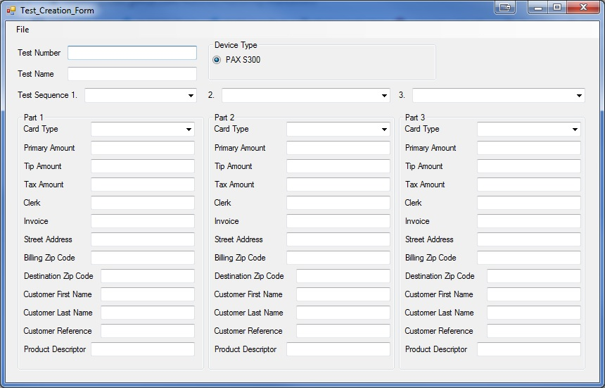
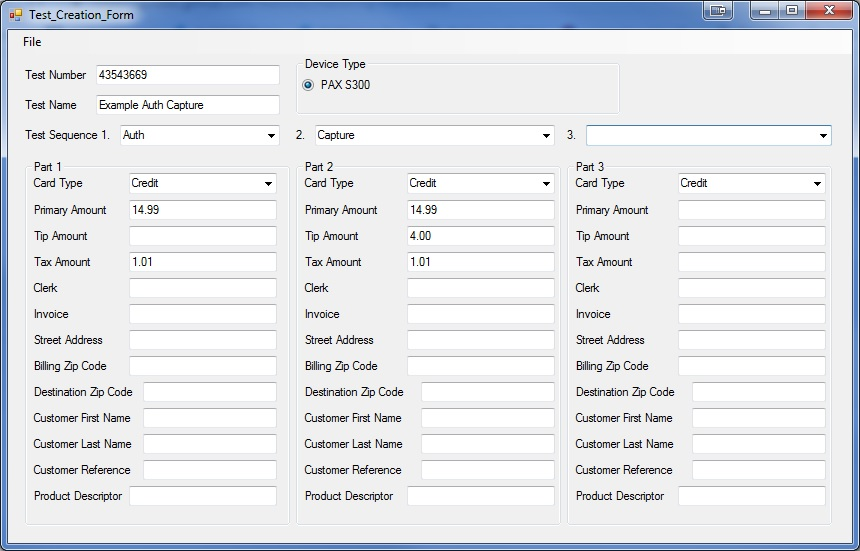
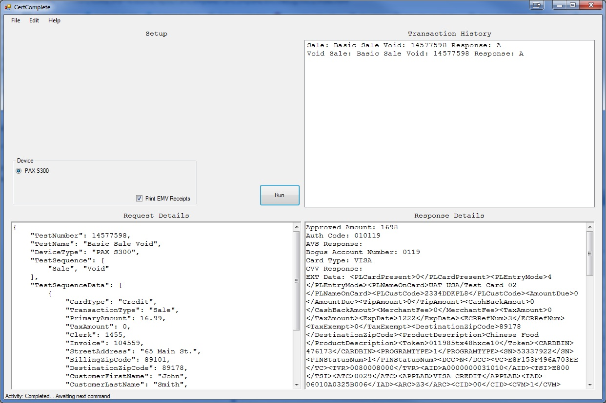
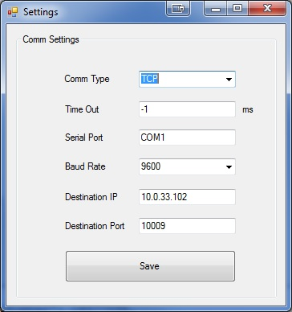
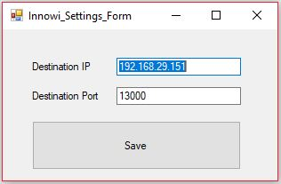

# CertComplete

## Creating Transactions

### Single Part Transactions
In order to create a transaction the recommended way is to use the test creation tool.  
Select **File->New->Test** to open the test creation window.  

*Mandatory Fields* 
* *Test Number* - This can be any arbitrary integer number. 
* *Test Name* - A name for the test. Suggestion: Use the test sequence to help identify tests with different control flows. 
* *Test Sequence 1.* - The type of transaction request. eg. Auth, Capture, Void. 
* *Part 1 Card Type* - Credit or Debit. 
* *Primary Amount* - The amount of the transaction **without** tax or tip. 
 
*All other fields are Optional*

Select **File->Save** and save your test to a directory of your choosing. Then you may close the window, edit your test, or create a new test entirely.

### Multi-Part Transactions
Follow the same instructions for Single Part Transactions above to get started. Then you will want to add aditional details to Test Sequence 2. 
 
*Example* 
Let's say you want to test an Auth Capture flow. To do this we set up Test Sequence 1 as an Authorization. Next we set up Test Sequence 2 to be a capture. See below:  

*Mandatory Fields* 
* *Test Number* - This can be any arbitrary integer number. 
* *Test Name* - A name for the test. Suggestion: Use the test sequence to help identify tests with different control flows. 
* *Test Sequence 1.* - The type of transaction request. eg. Auth, Capture, Void. 
* *Part 1 Card Type* - Credit or Debit. 
* *Primary Amount* - The amount of the transaction **without** tax or tip. 
 
*All other fields are Optional*

Again select **File->Save** and save your test to a directory of your choosing. Then you may close the window, edit your test, or create a new test entirely.

## Running a Test
In order to run a test transaction from the main screen select **File->Import->Test** and select a test to run. Tests are stored in JSON format and have multiple subcomponents.
See the Understanding the JSON Structure section below. 

Select the device you would like to send the transaction to, in this case I have chosen the PAX S300. 
Check if you would like to an EMV compliant receipt. (So far supports TSYS spec.) 
Then click Run, and follow the on screen prompts from the device.  

### Understanding the Output
The output is separated into two sections. 
The top right pane shows the transaction history and color codes various response types. 
The bottom right pane shows the values returned from the device API in a more raw format, adding each additional request sequentially to the pane. 

### EMV Receipts
If you selected to Print EMV Receipts, an EMV compliant Customer and Merchant Receipt will be automatically built for you. Upon transaction completion from the device,
 a dialog box will prompt you where you would like to save your recepts as PDF. Simply select a location and click Save. 

## Configuring Devices
To configure a device, select **Edit->Device Configuration->[Device Manufacturer]->[Device Type]**. This opens a settings dialog with potential options.

### Configuring PAX S300
For the S300 Device set the settings as shown if not already done so, but make sure to set the IP address to the IP address of the device. (Yours will likely be different from shown) 

### Super Secret PAX configurations
You may set individual device level variables with this special request. NOTE: You must know the variable name or this will fail. 
Set the CardType to "Credit" 
Set the TransactionType to "Manage" 
Create a value "VarName" and set the value to the variable name you want to set. (This is a pax named variable, not Shift4). 
Create a value "VarValue" and set the value to the variable value you want to set. This must be an acceptable value on PAX's side for this to work. 

### Configuring Innowi ChecOut M
The first thing to do is to ensure that you have the Innowi Proxy program running on the device. You can acquire the latest version [here](https://drive.google.com/open?id=1tLhps5Omh3cAksSa9tZ0VLZi6SMUOsn3). 

For the ChecOut M device, set the settings as shown if not already done so. Ensure that the IP address is the address of the device. At this time it is recommended to NOT change the default port of 13000. 

## Understanding the JSON Structure

The JSON structure 5 main components.  
**TestNumber** - This is used as a unique identifier. At present it doesn't relate to much, but the idea is to tie it to specific processor test numbers for cross reference. 
**TestName** - This is the name identifying the test. This can be whatever you like that helps you remember what the test is for or is doing. 
**DeviceType** - This is used to differentiate which device dll is called for processing. It is suggested not to change this. (Note: This is automatically filled in by the test builder.) 
**TestSequence** - This is used to identify the general sequence of a test. For example Auth Capture flows. Since each Auth and Capture are separate requests issued to the device, they are called out specifically here. (Note: Each TestSequence item should have a corresponding TestSequenceData Object) 
**TestSequenceData** - This array of sequence data represents the parameters that are sent to the device's API. While it is possible to edit these fields and values correctly, great care should be taken when doing so as this may cause unexpected behavior. 
 
Each of the TestSequenceData Object Values have certain restrictions, but the nature of those restrictions are device API dependent. For this reason it is suggested to use the test builder when building initial tests for a given device as error condition checking is performed by the test builder. 

## Contact and Suggestions
If you would like to reach the developer please send emails to tcotta@shift4.com.

### Bug Reporting
Please send bug reports to the developer. For best results please send the following:  
* A brief description of bug. 
* A statement, document, or other form of preconditions
* A statement, document, or other form of postconditions
* A screenshot of the particular screen on which the error occurs if possible.

### Suggestions & Feature Requests
Please send suggestions and Feature requests to the developer with Subject: CertComplete Feature Request.

Testing Random Updates